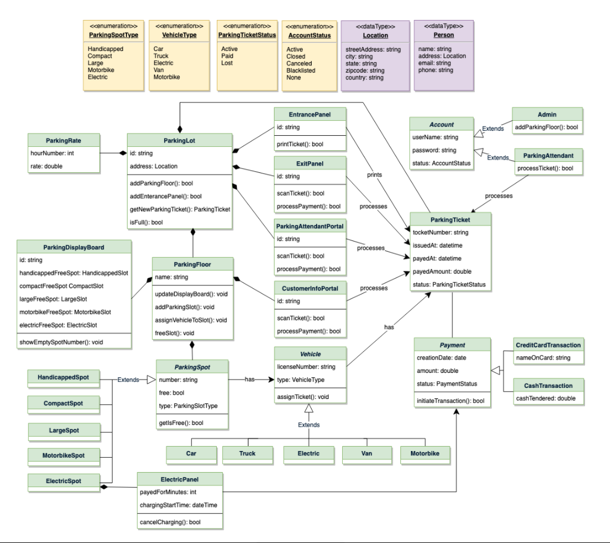

# Parking Lot

> ## System Requirements:
> 1. Parking lot has multiple floors, where customer can park their cars.
> 2. Each parking floor will have many parking spots. The system should support multiple types of parking spots such as Compact, Large, Handicapped, Motorcycle, etc.
> 3. There are different entry and exits.
> 4. Customer has to get the parking ticket at the entry.
> 5. Customer can pay the parking fee at an attender or during an exit.
> 6. Customer can pay with cash (making it easy for implementation).
> 7. Customer can pay at the parking info-portal, that is present in different floors of the complex.
> 8. Parking can be done only when the slot is Available.
> 9. Entrance board should show how many parking sports are currently available.
> 10. Each parking floor should have a display board showing any free parking spot for each spot type.
> 11. The system should support a per-hour parking fee model. For example, customers have to pay $4 for the first hour, $3.5 for the second and third hours, and $2.5 for all the remaining hours.

> ## Not in scope:
> * No special parking for electric cars.

## Entities:

| Entity | Description |
| --- | --- |
|Admin| Responsible for adding or updating reservations |
|Customer| Customer gets the parking ticket and pay for it|
|Parking Attender| Performs activities on behalf of customer|
|System|Display the available parking slots per type|

## Use Cases:

* System has all the available slots
* Customer comes and parks his vehicle:
    * Customer takes a ticket from that floors info-portal or from parking assistance.
    * When parked there should be one slot reduced at that floor, as well as the whole system.
    * Parking ticket will have the vehicle and floor information.
* Customer planning to the parking:
    1. Pay the parking fee.
        * Fee can be paid at info-portal
        * Fee can be paid to parking assistance
        * Fee can be paid at the exit (in step 2)
    2. Takes the car to exit, and provide the parking ticket
        * If fee is not paid, then pay the fee.
        * Increase the available parking slot at the floor where customer had parked the car.

## Objects:

|Object|Definition|
|---|---|
|ParkingLot| This will have list of Parking Floors, name and address, and total available slots per type.|
|ParkingFloor | This will have list of Parking Slots, and the available slots per type.|
|ParkingSpot| type, available/parked|
|Account| This will be a user with name, it can be eiter admin, or parking attender |
|ParkingAttender| Inherited from account, also has functionality to createTicket/payTicket|
|Admin | Inherited from account, also has functionality to addParkingSlots, ParkingFloor and Exits|
|Vehicle| Each vehicle will have make, model, year, number and type|
|ParkingTicket| This class will encapsulate a parking ticket. Customers will take a ticket when they enter the parking lot.|
|ParkingDisplayBoard| THis system will take care of displaying the available slots per type.|
|EntryPanel / ExitPanel| This will have a functionality to generate a ticket or pay for ticket|
|Payment|THis will be responsible for the payments|
|ParkingRate| This will be a constant with rates for each type and hours.|
|ParkingInfoPortal| This will have similar functionality as Parking Attender, but will be used by Customer|
|ParkingAttenderPortal| This portal will be used by ParkingAttender to perform his actions.|
|ParkingSystem| This the main system that Runs the software.|

## High Level Design

