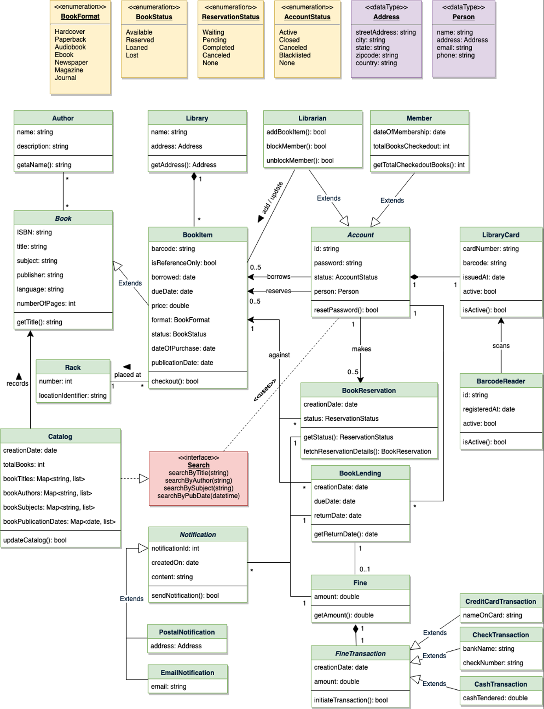

# Library Management

> ## System Requirements:
> 1. Any library member should be able to search books by their title, author, subject category as well by the publication date.
> 2. Each book will have a unique identification number and other details including a rack number which will help to physically locate the book.
> 3. There could be more than one copy of a book, and library members should be able to check-out and reserve any copy. We will call each copy of a book, a book item.
> 4. The system should be able to retrieve information like who took a particular book or what are the books checked-out by a specific library member.
> 5. There should be a maximum limit (5) on how many books a member can check-out.
> 6. There should be a maximum limit (10) on how many days a member can keep a book.
> 7. The system should be able to collect fines for books returned after the due date.
> 8. Members should be able to reserve books that are not currently available.
> 9. The system should be able to send notifications whenever the reserved books become available, as well as when the book is not returned within the due date.
> 10. Each book and member card will have a unique barcode. The system will be able to read barcodes from books and members&#39; library cards.

> ## Use Case:
> 1. Add/Remove/Edit Book
> 2. Search CatLog
> 3. Register/Cancel New Account
> 4. Check-out Book
> 5. Reserve Book
> 6. Renew Book
> 7. Return Book

> ## **Objects:**
>
> | **Object** | **Definition** |
> | --- | --- |
> | **Book** | **Book id, Title, Author, subject, Category, Count** |
> | **Author** | **Author Id, Author name, and List of books** |
> | **Library** | **Library id, and List of racks** |
> | **Rack** | **Rack id, list of Books** |
> | **Person** | **user id, name, address, email** |
> | **Member** | **This is a person with library card, and total books checked out** |
> | **Librarian** | **This is a person, with checkout, create\edit\block Member** |
> | **LibraryCard** | **Card Id, user id, bar code** |
> | **Account** | **This will extend from Librarian or from Member** |
> | **BarCodeReader** | **Reads book\member bar code** |
> | **Reservation** | **This is to reserve a book** |
> | **BookingReservation** | **This will allocate the book to user** |
> | **ReturnReservation** | **This will take away the book from user** |
> | **WaitlingListReservation** | **This will add user to the book waiting list** |
> | **Fines** | **Collect fines** |
> | **Notification** | **This will take care of sending the notification** |

##High Level Design